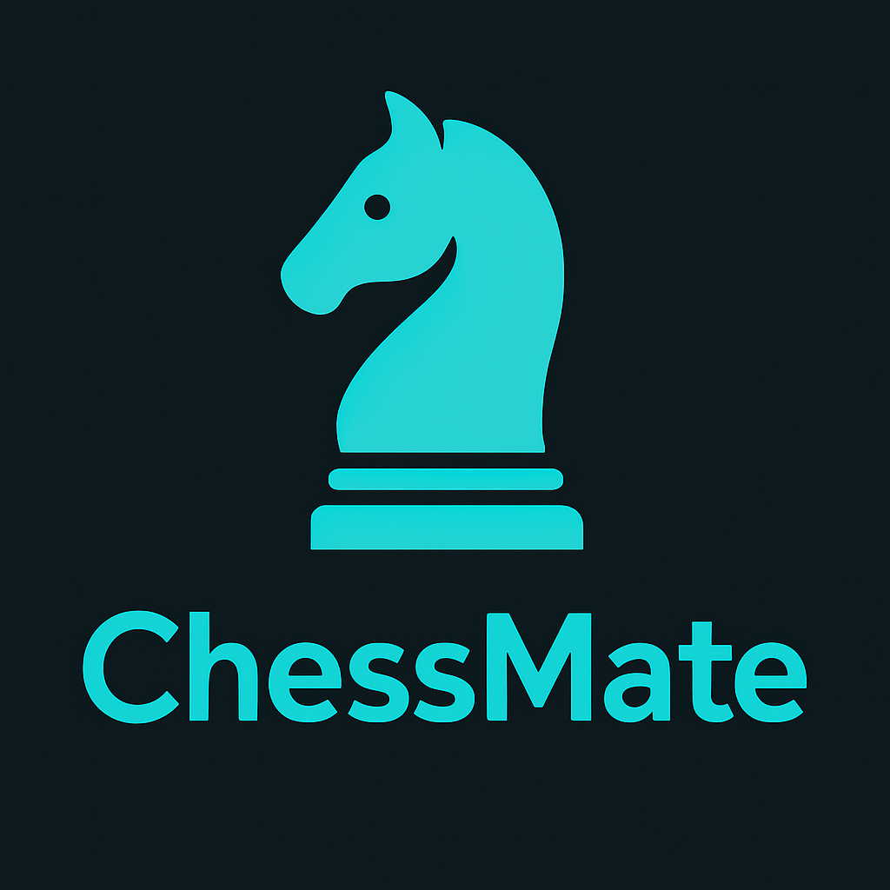
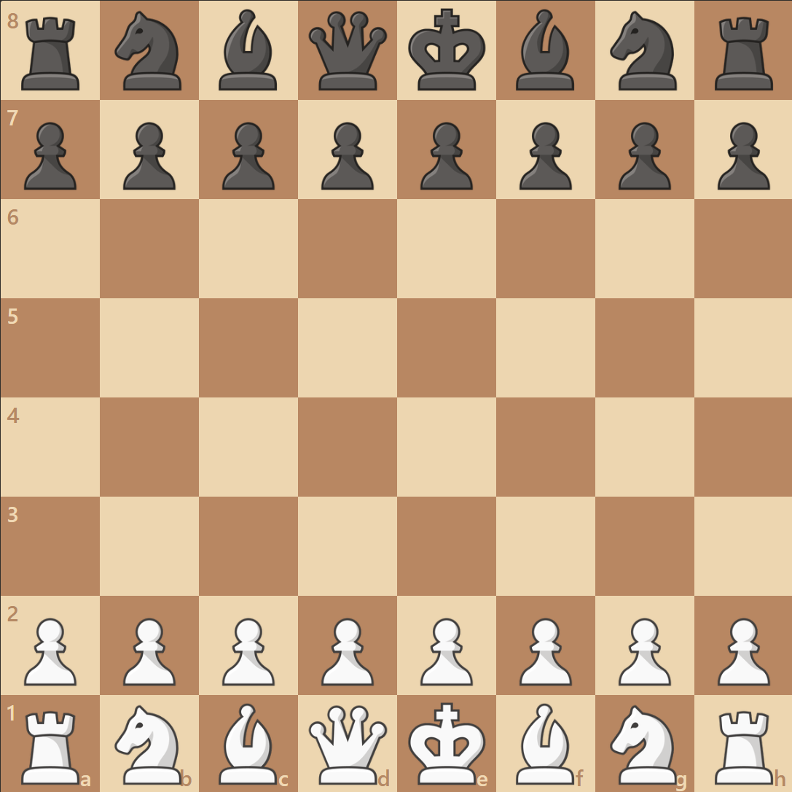
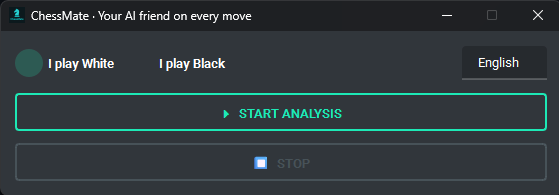
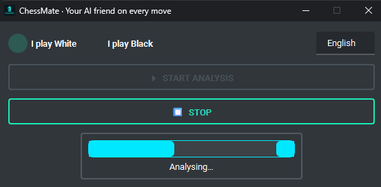
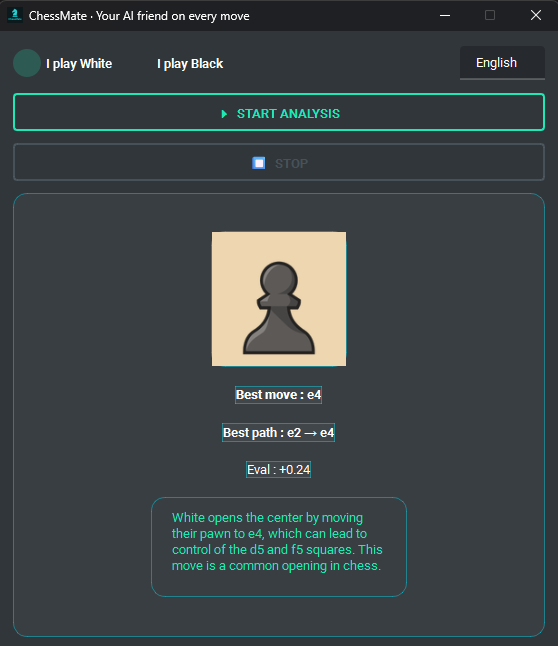

# ChessMate – Your AI friend on every move ♟️

<p align="center">
  
</p>

> **Educational & personal‑use only.**  
> ChessMate is meant to help you **study plans, tactics, and evaluation** while you play.  
> Please respect the Terms of Service of any chess platform you connect to and **do not use ChessMate for unfair assistance in rated games.**

---

## ✨ Features
- **Live board OCR ➜ FEN** using a ResNet‑18 piece classifier  
- **Top‑3 Stockfish lines** + LLM explanation (if enabled)  
- One‑click overlay UI with modern dark‑teal theme  
- Works with _any_ desktop chess board (chess.com, lichess, PGN viewer, etc.)  
- Runs fully offline except for the optional local LLM endpoint

---

## 🗒️  Requirements
| Tool | Tested version |
|------|----------------|
| Python | 3.9 – 3.12 |
| PySide6 | 6.6 |
| torch | 2.2 |
| torchvision | 0.17 |
| opencv‑python‑headless | 4.9 |
| python‑chess | 1.999 |
| qt‑material | 2.14 |
| mss | 9.0 |
| requests | 2.31 |
| textwrap3 | 0.9 |
| Stockfish engine | ≥ 16 |

👉  A ready‑made `requirements.txt` is included – just run

```bash
python -m pip install -r requirements.txt
```

---

## ⚙️ Environment variables (optional)

| Variable | Purpose | Default |
|----------|---------|---------|
| `LM_ENDPOINT` | URL of your local LLM server (`/v1`) | `http://localhost:1234/v1` |
| `LM_MODEL`    | Model name passed to the endpoint   | `dolphin-2.6-mistral-7b` |
| `LM_API_KEY`  | Bearer token header                 | `lm-studio` |
| `STOCKFISH_PATH` | Override auto‑detected engine path | – |

---

## 🎯 Calibrating board coordinates

1. **Open** your favourite chess site in a fixed window.  
2. **Take a screenshot** (`Prt Scr`) and paste into **MS Paint** (or any image tool).  
3. Zoom in and note the **pixel (x, y)** of the top‑left corner of **a8** and the board size.  
4. Edit `vision.py`:

```python
LEFT = 441   # x of a8
TOP  = 237   # y of a8
SIZE = 1088  # board is square → SIZE × SIZE
```
5. Change your board on the game to this theme: 

<p align="center">
  
</p>

6. Save & run `python -m vision` to verify the 64 cropped squares look correct.

Repeat once per screen resolution or if you move/resize the board.

---

## 🚀 Quick start

```bash
python main.py
```
<p align="center">
  
</p>
<p align="center">
  
</p>
<p align="center">
  
</p>

1. Choose **“I play White / Black”**.  
2. Press **▶ Launch analysis**.  
3. After ~1 s you’ll see:
   * Piece icon  
   * **Best move** + SAN  
   * Evaluation in pawns  
   * Short LLM explanation (if a valid JSON reply is received)  

Stop with the **⏹ button** or just close the window.

---

## ⌨️ Change the language

With a simple switch ( other languages in the future versions )

(See `main.py` to customise.)

---

## 🛠️  Troubleshooting

| Symptom | Fix |
|---------|-----|
| “`stockfish not found`” | Put the binary in `engines/` or set `STOCKFISH_PATH`. |
| “`san() expect move legal…`” | The LLM produced an invalid move. ChessMate automatically falls back to Stockfish and skips the explanation. |
| Incorrect FEN | Re‑check board coordinates and lighting; retrain `resnet18_chess.pt` if using a very different theme. |

---

## 🙏 Acknowledgement

A special thank‑you to **SimonLariz**, creator of **ChessToFEN**.  
Your elegant board‑recognition project laid the foundation for ChessMate’s OCR pipeline and continues to inspire open‑source chess enthusiasts everywhere. ♟️

---

## 📄 License

MIT.  Feel free to fork & improve – and if you build something cool, let me know!

Happy analysing!  
**– The ChessMate team** ⚔️
