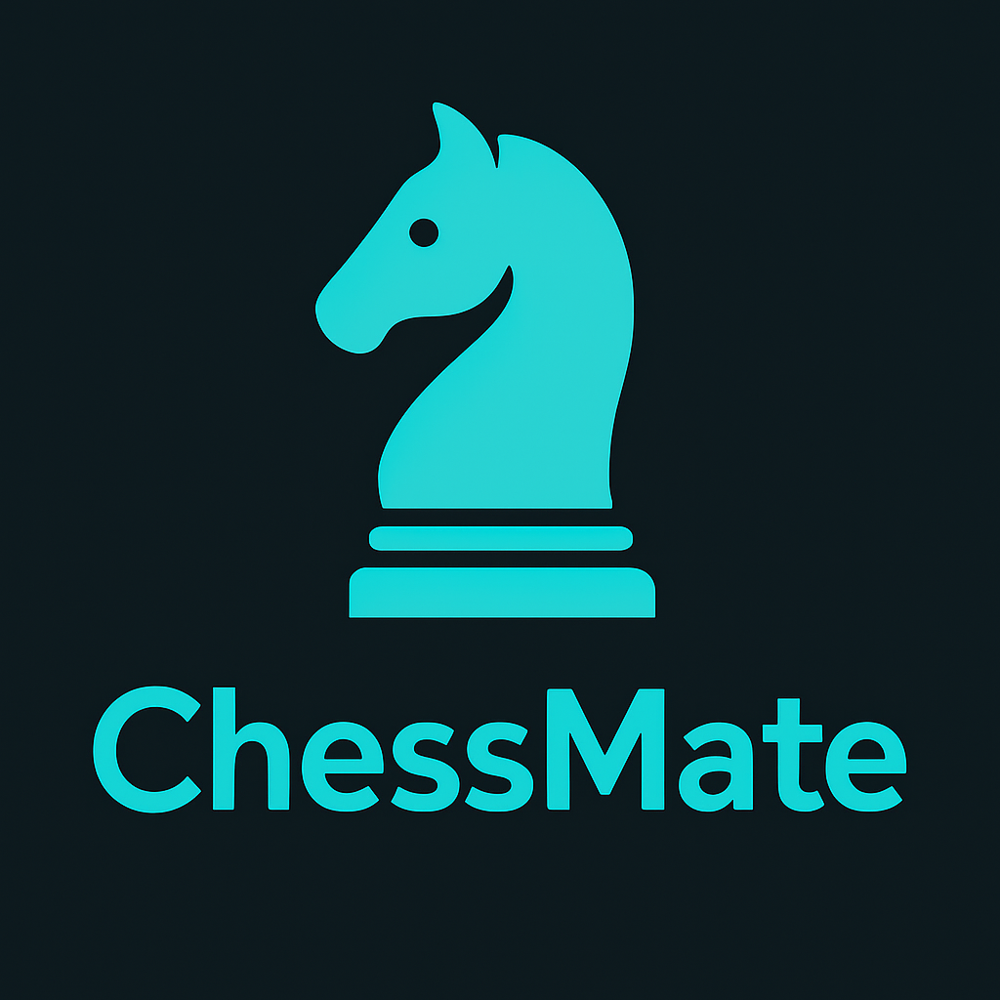
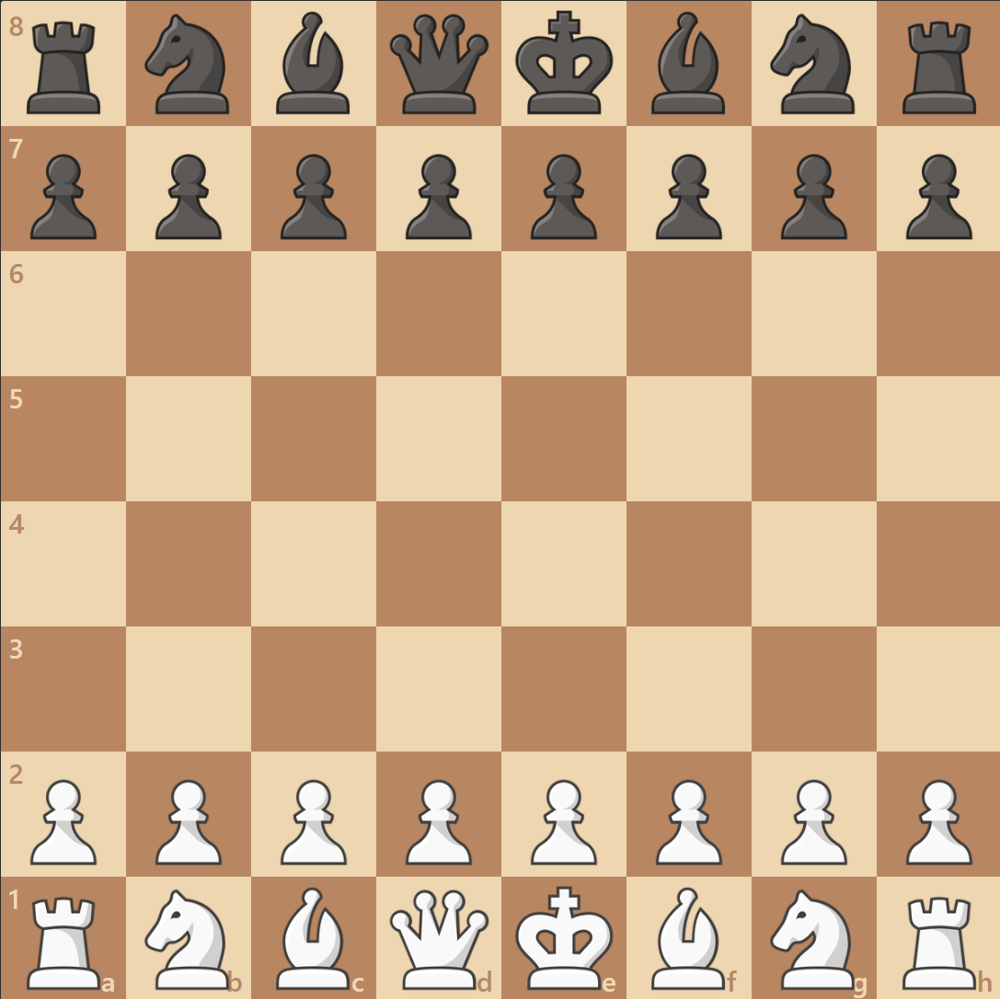

# ChessMate – your friendly on-screen chess assistant ♟️

<p align="center">
  
</p>

> **Usage pédagogique et personnel uniquement.**
> ChessMate sert à **étudier des plans, des tactiques et des évaluations**.
> Respectez les conditions d'utilisation des plateformes d'échecs et
> **n'utilisez pas ChessMate pour tricher dans une partie classée.**

---

## ✨ Fonctionnalités

- **Lecture du plateau à l'écran → FEN** via un classifieur ResNet-18 intégré
- **FEN complet** : droits de roque et prise en passant réellement déduits
  (donc le moteur peut proposer O-O / O-O-O)
- **Orientation gérée** : le plateau retourné quand vous jouez les Noirs est
  correctement interprété
- **Stockfish** avec profils bullet / blitz / rapid / analysis, et arrêt
  anticipé quand la recherche se stabilise
- **Explication du coup par un LLM local** (optionnel), dans les 6 langues de
  l'interface
- **Deux modes** : surlignage (flèche par-dessus le plateau) ou exécution
  automatique du coup à la souris, avec **vérification que le coup est passé**
- **Calibration en un clic**, mémorisée par résolution d'écran
- Thème sombre / clair, interface en 🇫🇷 🇬🇧 🇪🇸 🇷🇺 🇨🇳 🇸🇦 (arabe en RTL)
- Fonctionne entièrement hors ligne, sauf l'appel facultatif au LLM local

---

## 🗒️ Prérequis

| Outil | Version testée |
|-------|----------------|
| Python | 3.10 – 3.13 |
| PySide6 | 6.9 |
| torch / torchvision | 2.7 / 0.22 |
| python-chess (`chess`) | 1.11 |
| opencv-python | 4.12 |
| mss | 9.0 |
| Stockfish | ≥ 16 (fourni dans `engines/` pour Windows) |

```bash
python -m pip install -r requirements.txt
```

> Pour profiter d'un GPU, installez `torch` en suivant
> [pytorch.org](https://pytorch.org/get-started/locally/) **avant** cette
> commande. Le CPU suffit largement : une lecture de plateau prend ~0,3 s.

---

## 🚀 Démarrage rapide

```bash
python main.py
```

1. Ouvrez votre partie (chess.com, lichess, un visualiseur PGN…).
2. Choisissez **« Je joue les Blancs / les Noirs »**.
3. Cliquez sur **🎯 Calibrer** (ou touche `R`) — ChessMate localise le plateau
   et mémorise sa position dans `config.json`.
4. Choisissez le mode : *Surlignage uniquement* ou *Jeu automatique*.
5. **⏵ Lancer l'analyse** (ou `Espace`).

L'application surveille ensuite le plateau en continu : dès que la position
change, elle analyse et propose le coup suivant.

### ⌨️ Raccourcis

| Touche | Action |
|--------|--------|
| `Espace` | Démarrer / arrêter l'analyse |
| `W` / `B` | Jouer les Blancs / les Noirs |
| `M` | Basculer Auto ↔ Surlignage |
| `C` | Thème sombre ↔ clair |
| `R` | Recalibrer le plateau |

> **Arrêt d'urgence :** en mode automatique, poussez la souris dans le coin
> **haut-gauche** de l'écran — le failsafe PyAutoGUI interrompt tout.

---

## 🎯 Calibration

Le rectangle du plateau est détecté automatiquement (contours quasi-carrés
départagés par un score de « damier-ité ») puis enregistré dans `config.json`,
**indexé par résolution d'écran**. Il n'y a plus de constantes `LEFT` / `TOP` /
`SIZE` à éditer dans le code.

Recalibrez (`R`) si vous déplacez ou redimensionnez la fenêtre de jeu.

Pour vérifier la détection en ligne de commande :

```bash
python vision.py                 # rectangle détecté + FEN lu + échiquier ASCII
python vision.py --dump          # écrit aussi les 64 imagettes dans data/
python vision.py --recalibrate   # ignore la calibration enregistrée
python vision.py --side b --flipped
```

Si le FEN affiché est faux, deux causes possibles :

1. **mauvais rectangle** → recalibrez, ou fixez-le à la main dans
   `config.json` :

   ```json
   { "boards": { "1920x1080": { "left": 441, "top": 237, "size": 1088 } } }
   ```

2. **thème d'échiquier inconnu du modèle** → voir la section suivante.

---

## ⚙️ Configuration (`config.json`)

Créé automatiquement au premier lancement. Clés principales :

| Clé | Défaut | Rôle |
|-----|--------|------|
| `engine_profile` | `"blitz"` | `bullet` / `blitz` / `rapid` / `analysis` |
| `engine_threads` | `null` | `null` → tous les cœurs |
| `engine_hash_mb` | `null` | `null` → valeur du profil |
| `min_square_confidence` | `0.80` | en dessous, la case est jugée douteuse |
| `max_uncertain_squares` | `0` | nb de cases douteuses tolérées avant abandon |
| `llm_enabled` | `true` | `false` → analyse moteur seule |
| `llm_timeout` | `12.0` | secondes |
| `autoplay_style` | `"click"` | `"click"` ou `"drag"` selon le site |
| `autoplay_verify` | `true` | recapture l'écran pour confirmer le coup |
| `dump_squares` | `false` | débogage : écrit les 64 imagettes à chaque capture |

### Variables d'environnement

| Variable | Rôle | Défaut |
|----------|------|--------|
| `LM_ENDPOINT` | URL du serveur LLM local (`/v1`) | `http://localhost:1234/v1` |
| `LM_MODEL` | nom du modèle | `dolphin-2.6-mistral-7b` |
| `LM_API_KEY` | jeton Bearer | `lm-studio` |
| `STOCKFISH_PATH` | binaire Stockfish à utiliser | auto |

---

## 🧠 Réentraîner le classifieur

⚠️ Le `dataset/` livré ne contient que **~3 images par classe**. Le modèle
fourni ne reconnaît donc de façon fiable que le thème d'échiquier utilisé lors
de la capture :

<p align="center">
  
</p>

Pour l'adapter à votre thème :

```bash
# 1. capturer des positions variées
python vision.py --dump          # → data/00.png … data/63.png

# 2. trier les imagettes dans dataset/<classe>/
#    classes : pawn_light, knight_dark, …, empty
#    « light » = pièce blanche, « dark » = pièce noire

# 3. entraîner
python train_resnet.py --epochs 20
```

`train_resnet.py` effectue un découpage stratifié train/validation, affiche
l'exactitude de validation et une matrice de confusion, s'arrête
automatiquement quand il stagne, utilise le GPU s'il y en a un, et écrit
`resnet18_chess.pt` **ainsi que** `classes.json` (l'ordre des classes, dont
l'inférence dépend).

Visez au moins **50 images par classe** pour un modèle robuste.

---

## 🧪 Tests

```bash
python tests/test_fen.py        # roque, en passant, compteurs — sans écran
python tests/test_engine.py     # Stockfish : mat en 1, MultiPV, singleton
python tests/test_pipeline.py   # chaîne complète sur les imagettes de data/
```

---

## 🛠️ Dépannage

| Symptôme | Cause / solution |
|----------|------------------|
| `Stockfish introuvable` | Placez le binaire dans `engines/`, ajoutez-le au `PATH`, ou définissez `STOCKFISH_PATH`. |
| `Plateau introuvable` | Le plateau doit être entièrement visible et non masqué. Cliquez sur **Calibrer**, ou fixez le rectangle dans `config.json`. |
| `Position incertaine : N case(s)…` | Le thème n'est pas reconnu → réentraînez le modèle, ou augmentez `max_uncertain_squares` à vos risques. |
| `Position illisible … Vérifiez la couleur sélectionnée` | La couleur choisie ne correspond pas au trait, ou le plateau est mal cadré. |
| FEN miroir (rois et dames inversés) | Orientation : vérifiez le bouton Blancs / Noirs. |
| `LLM indisponible` | Le serveur local ne répond pas. ChessMate continue avec l'analyse moteur seule ; passez `llm_enabled` à `false` pour masquer le message. |
| Le coup n'est pas joué sur le site | Passez `autoplay_style` à `"drag"`. Certains sites refusent le clic-clic. |
| `Coup non confirmé à l'écran` | Le clic n'a pas abouti (fenêtre sans focus, animation trop lente). ChessMate se resynchronise tout seul. |
| Flèche décalée sur un écran HiDPI | Signalez-le : la conversion utilise `devicePixelRatio`, mais les combinaisons multi-écrans à facteurs différents restent délicates. |

---

## 🏗️ Architecture

```
main.py        interface Qt + orchestration (QThread + signaux)
 ├── theme.py      palette, typographie et feuille QSS des deux thèmes
 ├── worker.py     analyse pure, sans Qt : vision → FEN → moteur → LLM
 │    ├── vision.py      capture, localisation du plateau, découpe en 64 cases
 │    │    └── classifier.py   ResNet-18 (remplace l'ancien module ChessToFEN)
 │    ├── fen.py         FEN complet : roque, en passant, compteurs
 │    ├── engine.py      Stockfish (instance unique, partagée)
 │    └── llm.py         explication du coup (API compatible OpenAI)
 ├── overlay.py    flèche transparente par-dessus le plateau
 ├── autoplay.py   exécution à la souris (promotion, roque, drag & drop)
 ├── i18n.py       traductions (lang/*.json)
 ├── config.py     réglages persistants (config.json)
 └── paths.py      chemins ancrés sur __file__
```

---

## 📄 Licence

Code ChessMate : **MIT** (`LICENSE`).
Stockfish, redistribué dans `engines/`, est sous **GPL v3** — voir
[`NOTICE.md`](NOTICE.md) pour les obligations exactes si vous redistribuez ce
dépôt.

Bonnes analyses !
**– The ChessMate team** ⚔️
